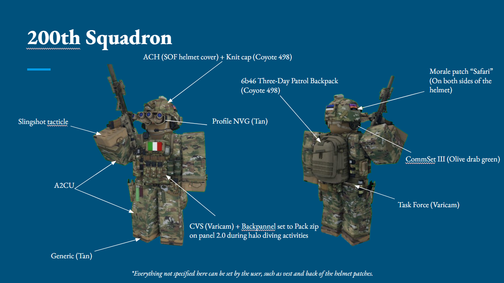

# 200th Airborne 

### Helmet:

- ACH with SOF helmet cover

- Safari moral patch

- Knit cap (Coyote 498)  
- NVG (customizable)  

### Face:  
- Profile NVG goggles  

### Ears:  
- Commset III (olive dab green)  

### Clothing  
- A2CU (Varicam)
- A2CU (Varicam)

### Gloves:  
- Slingshot tactile  

### Shoes:  
- Tan colour  

### Bag:  
- 6B46 Three-Day Patrol Backpack (varicam)  

### Vest:  
- CVS (varicam)  
(back panel will be set to the Pack Zip-On Panel 2.0 when halo diving)  

### Belt:  
- Task Force (varicam)

