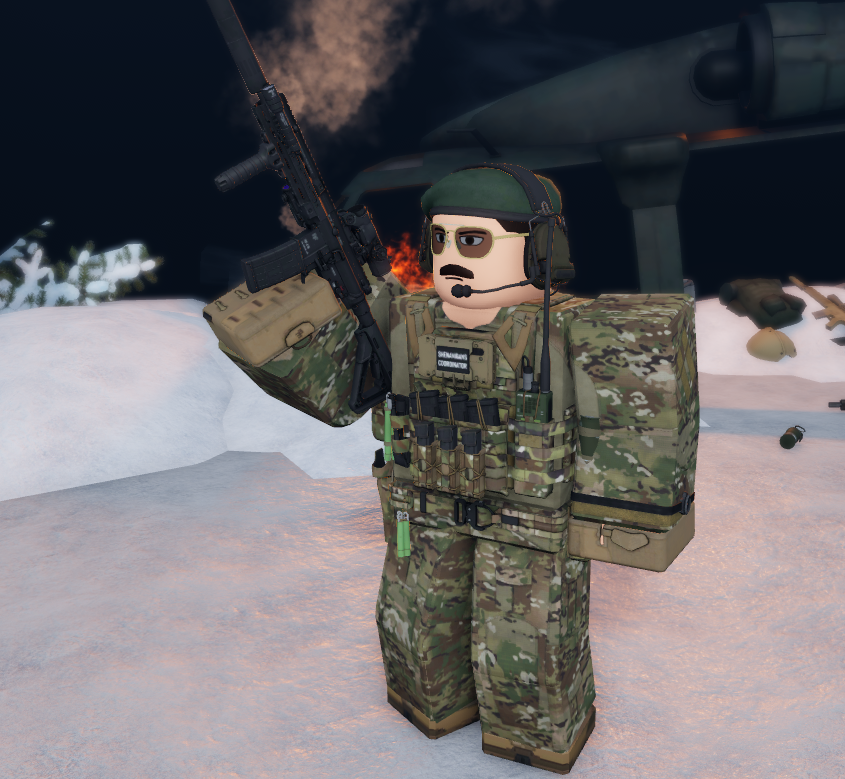
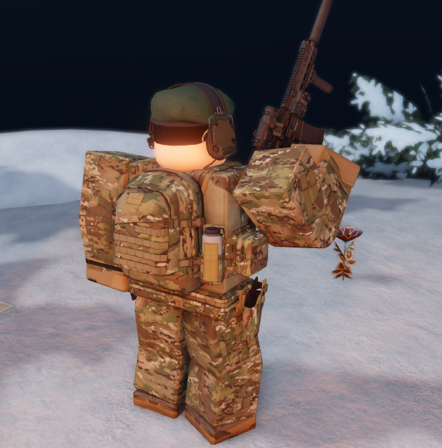

# Officer/Command Field Uniform

### Hat:
- Patrol cap (varicam/officers)
- Beret (green/command)

### Shoes:
- Tan

### Gloves:
- Slingshot Tactile

### Belt:
- Task Force (varicam)

### Bag:
- 1476A (varicam)

### Vest:
- MPC 2.0 (varicam)

### Earwear:
- Commset III (Olive dab green)

### Clothes:
- G3 Combat Shirt (Varicam)
- G3 Field Pants (varicam)

::: tip
Morale Patch for officers is per squadron.
:::

::: tip
Morale Patch for Command is "Shenanigans Coordinator".
:::

