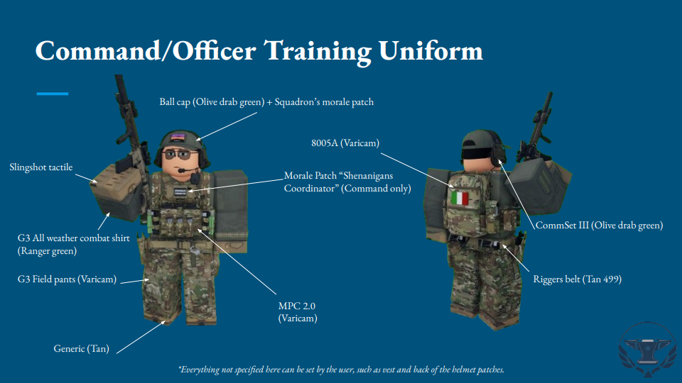

# Officer/Command Training Uniform

### Hat:  
- Ball Cap (ranger green)

### Gloves:
- Slingshot Tactile

### Shoes:
- Tan

### Earwear:
- Commset V (olive dab green)

### Belt:
- Riggers belt (tan)

### Vest:
- 6094A (varicam)

### Bag:
- 8005A (varicam)

### Clothes:
- G3 Field Pants (varicam)  
- G3 All Weather Combat Shirt (Ranger green)

