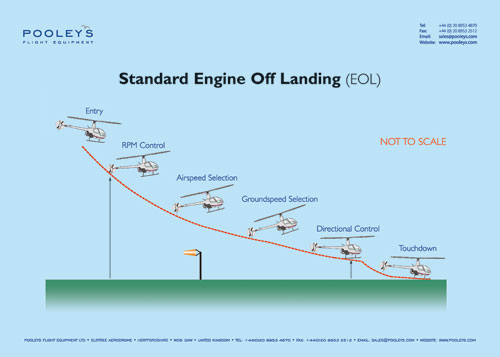

# Standard Deceleration (Decel)

On approach to the intended Landing Zone (LZ), pitch your nose up to achieve a desired, controllable airspeed. Set the helicopter down by decreasing collective, among other actions the pilot deems necessary.

::: tip
While very controllable, Decel landings done while approaching a defended Landing Zone (LZ) can expose the pilot to additional fire. The nose of the helicopter makes no significant change of heading.