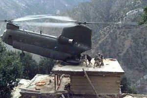

# Pinnacle

A variant of the toe-in landing typically done by rear-loading crafts like the CH-47 Chinook.

::: tip
Pinnacle landings are famously utilized for landing on rooftops with limited space that could not otherwise support the entire craft.
:::