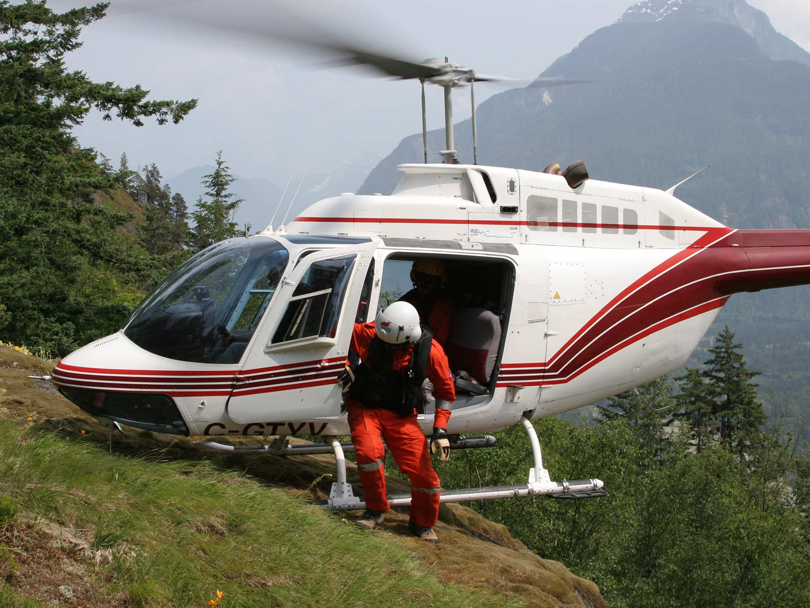

# Toe In

Helicopters do not need full surface area contact to be safe to dismount or mount from. A toe-in (sometimes referred to as "two-skid toe in" or "one-skid toe in", depending on if only one or both skids make contact) landing can be performed by only making contact with the ground via the front of the craft's wheels or skids.

::: tip
This is typically done to land in areas with uneven terrain.
:::

::: warning
Toe-in landings require the active attention of the pilot, as well as ideal ground conditions. Do not be afraid to abort unstable toe-in landings that are proving unsustainable to hold.
:::