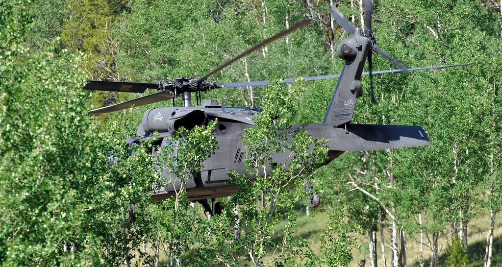

# Masking

Masking is a helicopter aviation term to mean using buildings, ridges, trees, or other terrain features to break line of sight and protect the craft. 

::: tip
Similarly, "popping out" of cover is called *unmasking*.
:::