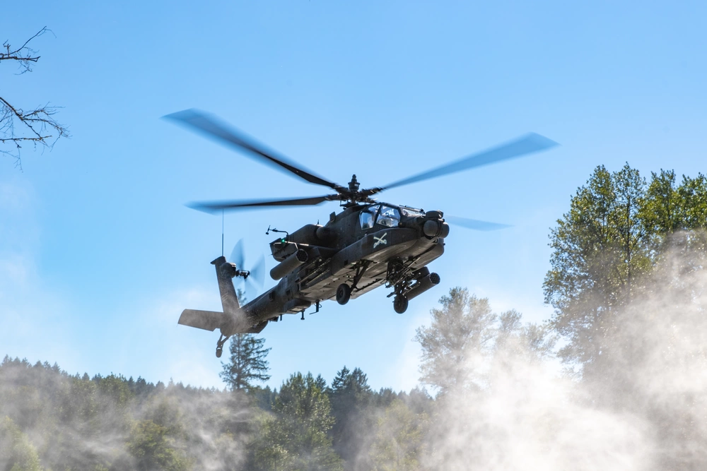

# Nap of the Earth

Nap of the Earth (NOE) is when a helicopter is flown at very low altitude, typically done to hide the helicopter from direct visual contact, radar detection, and man-portable anti air systems. 

