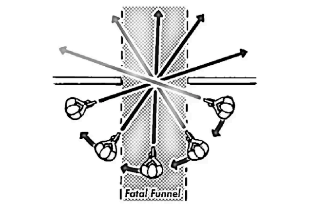

# The Fatal Funnel

**Tangos** will know your entry point **(the fatal funnel)** and will defend against that
entry point. This gives tangos the advantage. Enter the room quickly, clear the
funnel.

**DO NOT STOP IN THE FUNNEL.**

### Avoid Choke Points
Never stand in front of an open doorway, window, or hallway.
### Clear Angles
When looking into a room, use a technique called "slicing the pie." Take slow, wide, semicircular steps around the corner so you can visually clear the room from an advantageous angle before entering.
### Stay Mobile
If you must pass through, move quickly through the threshold and get to a point of cover immediately, rather than lingering in the middle of the opening.

**"Collapsing the fatal funnel" refers to room-clearing tactics where operators move swiftly through a dangerous choke point (like a doorway or hallway) to immediately push into a room, thereby eliminating the deadly exposure they face while lingering in the entryway.**