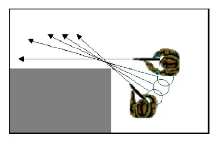

# Slicing the Pie

“Slicing the pie” is a corner technique done by aiming your weapon beyond
the corner into the direction of travel (without flagging) and side-stepping
around the corner in a circular fashion with the muzzle as the pivot point.

Note that this also applies when stacking up on your team when breaching
through doors.