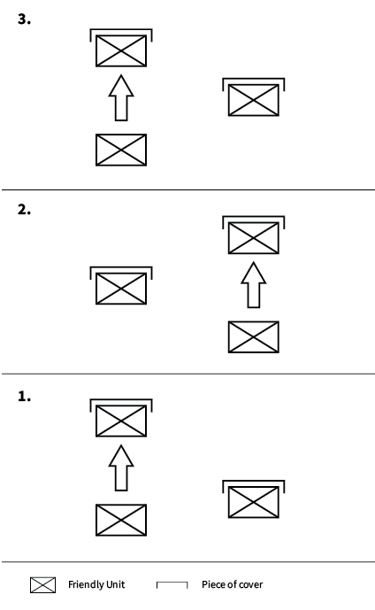

# Bounding Overwatch

Bounding overwatch refers to a fireteam-level movement technique where two elements (beit pairs of individual soldiers, or entire fireteams) take turns between moving and providing cover for the moving element.

1. Element A lays down fire, while element B is told to advance toward the enemy.
2. Element B reaches a point of cover, announces that they are providing cover for element A, and it is now element A's turn to advance.
3. Element B lays down fire, while element A is told to advance toward the enemy.
4. So on, so forth.

