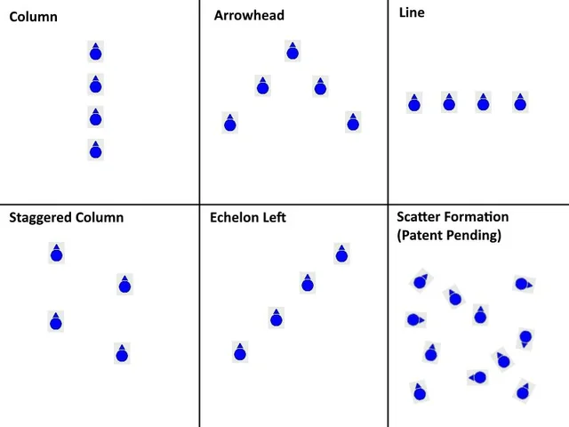
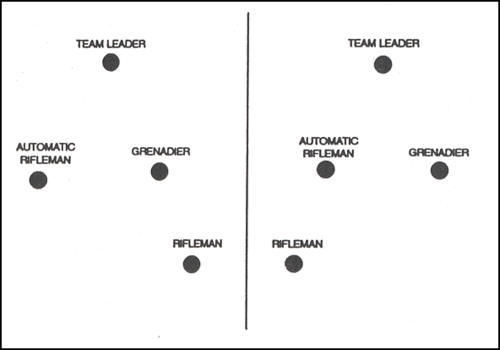
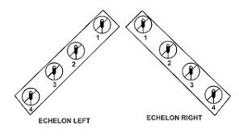

# Movement Formations

Moving as a fireteam, especially across open terrain, has several predefined formations such as below.

However, the most pertinent formations usually are the:

## Arrowhead (Wedge) Formation
This formation allows flexibility in responding to contact, while offering 360 degree awareness. The arrowhead uses an intuitive layout where the soldiers directly behind the point of the arrow (the team leader) observe the left and right flanks, while the rearmost troops observe the fireteam's rear. The point of the arrow typically observes forward, toward the direction of travel.

## Left/Right Echelon Formation
A flexible formation for responding to contact similar in purpose to the wedge, while biasing fields of fire to the direction of choosing.

## Line Formation

The line formation is the optimal means of approaching an area where contact is expected to come from the direction of travel or behind the direction of travel.

::: warning
The line formation may prove more vulnerable to attacks from the left and right flanks as they can be caught in enfilade.
:::

## Column Formation

The column formation is the optimal means of approaching an area where contact is expected to come from the flanks relative to the direction of travel.

::: warning
The column formation may prove more vulnerable to attacks from the front as they can be caught in enfilade.
:::