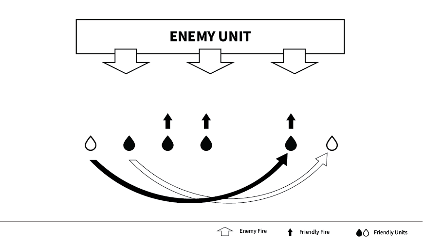
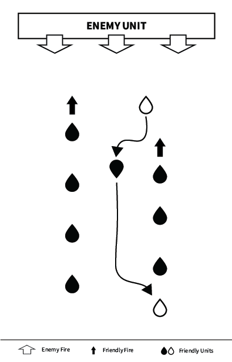

# The Peel

The peel refers to the act of applying bounding overwatch to a retreating maneuver towards a set direction. The team leader will declare a direction, usually to the length-wise of the formation, and beginning from the individual farthest from the intended direction, begin to move one by one, while the remainder of the squad continues to engage threats.

